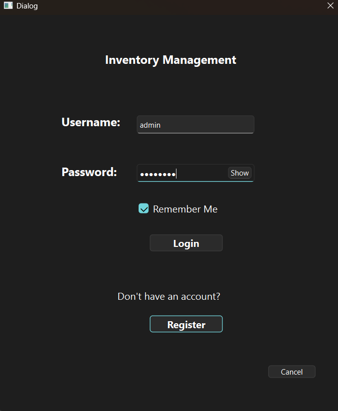
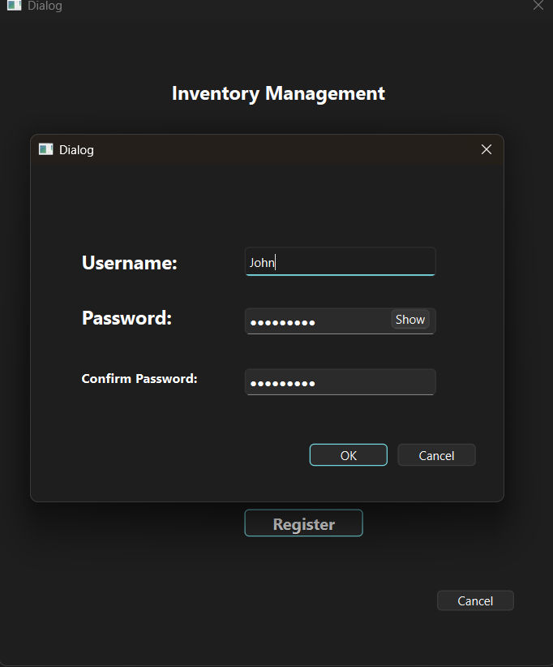
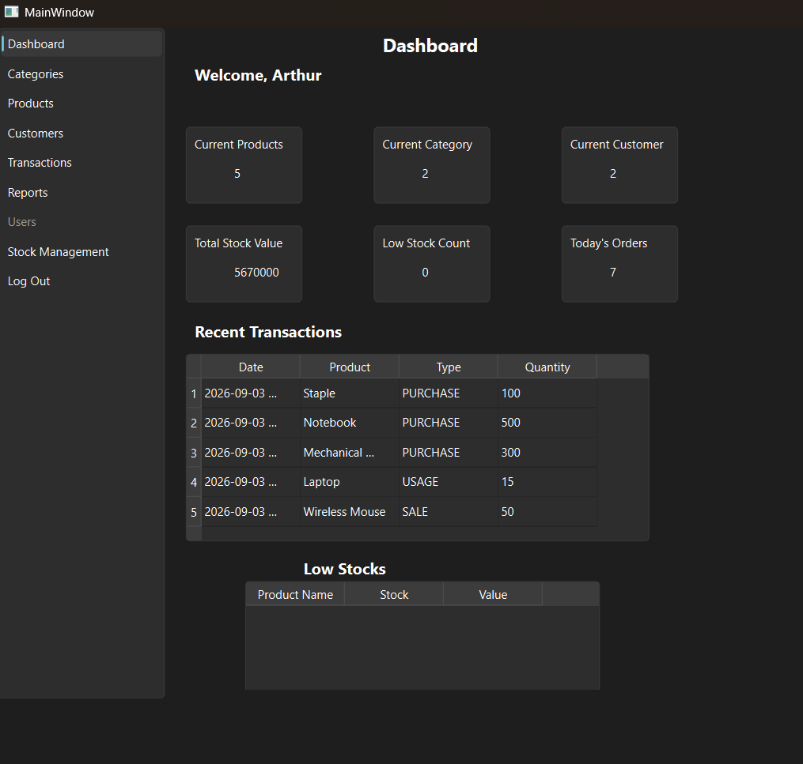
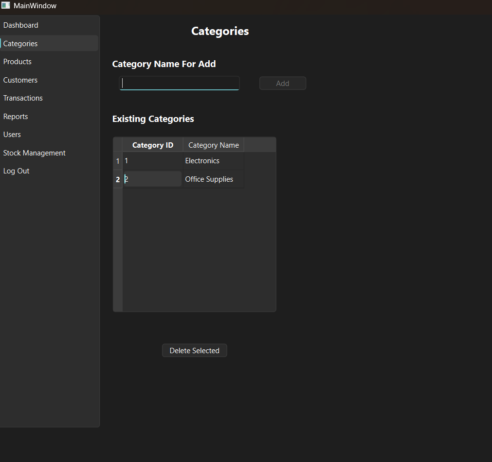
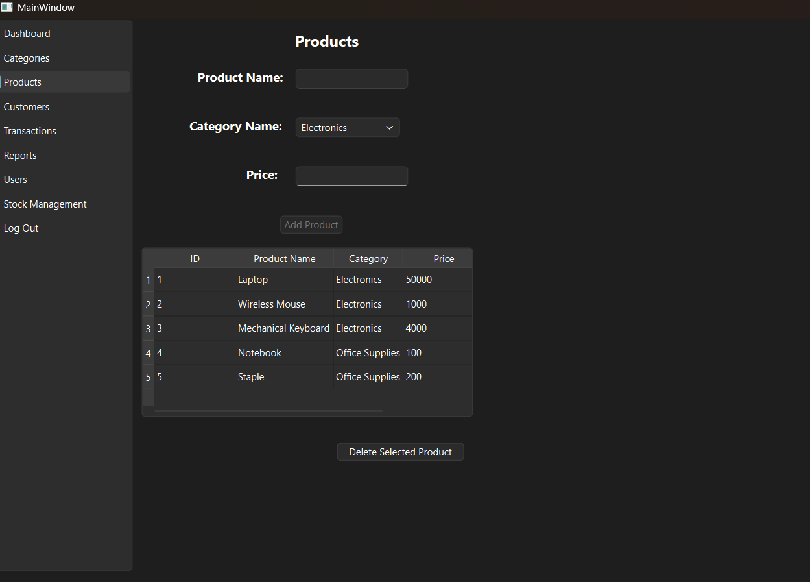
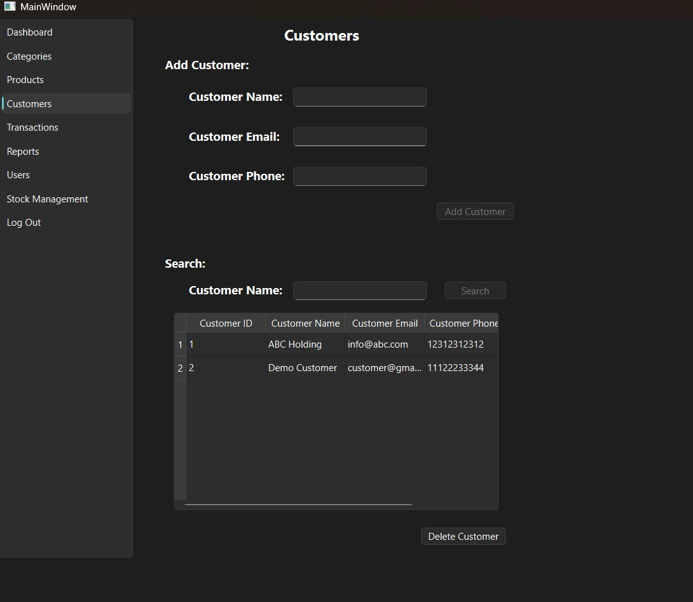
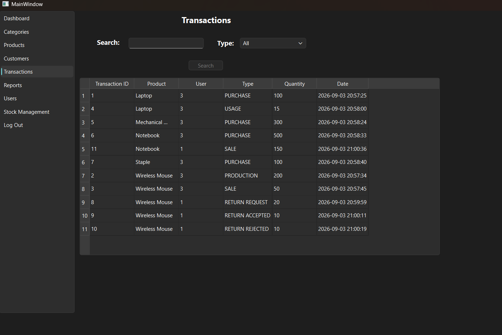
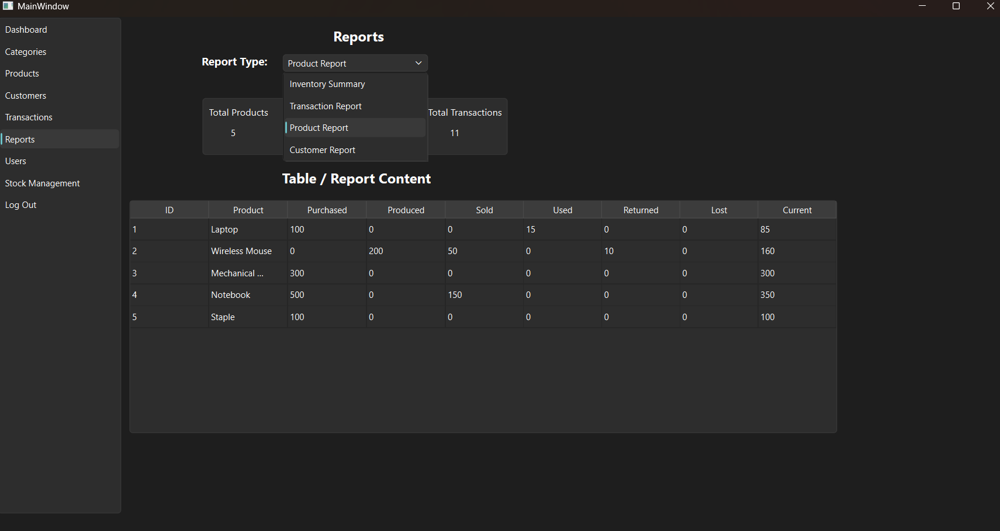
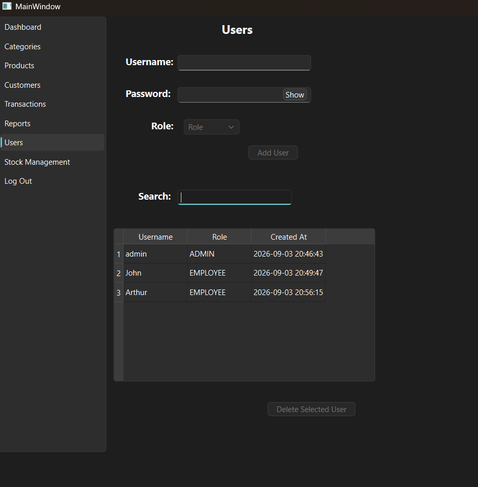
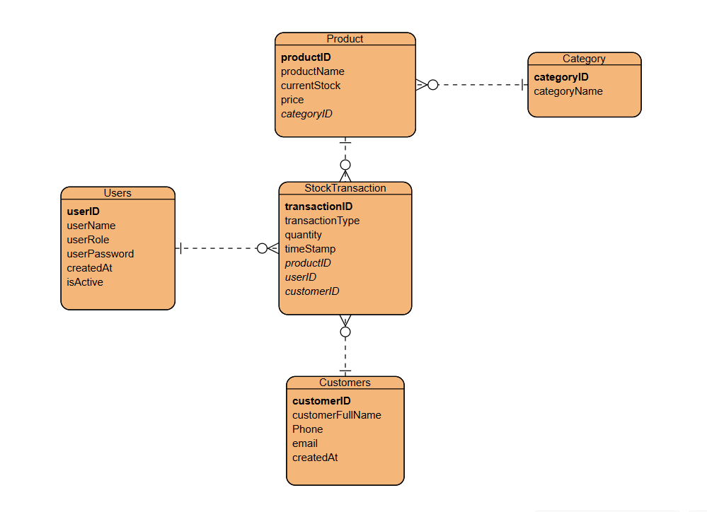

# Stock Management System

## Overview

Stock Management System is a desktop application developed to manage products, categories, customers, users, and stock transactions.

The application provides a graphical user interface built with Qt and uses MySQL for database management.

## Features

- User authentication with role-based access control
- User registration, search, and account management
- Product, category, and customer management
- Stock tracking with stock availability validation
- Multiple stock transaction types, including purchase, production, sale, usage, loss, and returns
- Return request processing with approval and rejection functionality
- Transaction history with search and filtering capabilities
- Dashboard with inventory statistics, recent transactions, low-stock monitoring, and total stock value
- Reporting functionality for inventory, transactions, products, and customers

## Technologies Used

- C++
- Qt 6.10
- MySQL Server 8.0.45
- MySQL Connector/C++ 8.0.33
- Visual Studio 2022

## Project Structure

```text
StockManagementQT/
|
+-- database/
|   +-- inventoryDB_schema.sql
|
+-- QtWidgetsApplication1/
|   +-- InventoryManager.cpp / InventoryManager.h
|   +-- databaseManager.cpp / databaseManager.h
|   +-- databaseConfig.example.h
|
|   +-- Category.cpp / Category.h
|   +-- Customer.cpp / Customer.h
|   +-- Products.cpp / Products.h
|   +-- Transaction.cpp / Transaction.h
|   +-- User.cpp / User.h
|
|   +-- DashboardPage
|   +-- ProductPage
|   +-- CustomersPage
|   +-- StockManagementPage
|   +-- TransactionsPage
|   +-- ReportsPage
|   +-- UsersPage
|
|   +-- logindialog
|   +-- registerdialog
|   +-- mainwindow
|   +-- main.cpp
|
+-- .gitignore
+-- README.md
+-- StockManagementQT.sln
```

## Requirements

To build and run the project from source, the following software is required:

- Visual Studio 2022
- Qt
- Qt Visual Studio Tools extension
- MySQL Server
- MySQL Connector/C++

## Database Setup

1. Install MySQL Server.
2. Open MySQL Workbench.
3. Open `database/inventoryDB_schema.sql`.
4. Execute the script.
5. The script creates the required database and tables.

## Database Configuration

The repository does not include personal database credentials.

1. Locate: databaseConfig.example.h
2. Create a copy of the file.
3. Rename the copied file to: databaseConfig.h
4. Enter your local MySQL credentials.

Example:
    #define DB_HOST "tcp://127.0.0.1:3306"
    #define DB_USER "YOUR_USERNAME"
    #define DB_PASSWORD "YOUR_PASSWORD"
    #define DB_SCHEMA "InventoryDB"

The databaseConfig.h file is excluded from Git using .gitignore.

## Build and Run

1. Clone the repository.
2. Open `StockManagementQT.sln` using Visual Studio.
3. Make sure Qt and MySQL Connector/C++ are properly configured.
4. Configure the database connection.
5. Build the solution.
6. Run the application.

## Default Login Credentials

After setting up the database:

Username: admin
Password: admin123

## Screenshots





















## Possible Future Improvements

- Refactor duplicated code to improve code maintainability
- Further improve the separation of responsibilities between application components

## Purpose

This project was developed as a learning project to improve practical skills in C++, object-oriented programming, database integration, and desktop application development with Qt.
